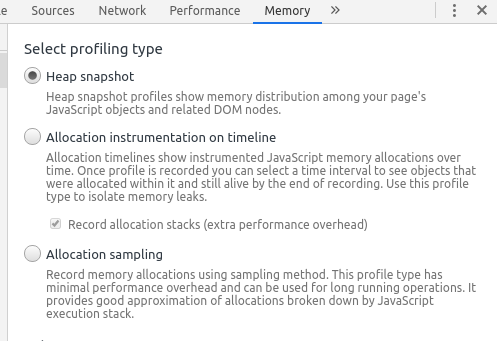

# memory-profiling

This project explores questions about memory consumption of components defined in ES6 modules.

## Garbage Collection Basics

JavaScript has automatic memory management. As opposed to languages like C with their explicit memory management using `free` and `malloc` calls, the JavaScript runtime uses a Garbage Collector (GC) that tries to free objects once they are no longer needed.

To approximate live and dead objects the runtime reduces the problem to finding reachable and unreachable objects.
An object on the heap is reachable if it is either referenced by a global variable or transitively referenced by another reachable object.

If and when an unreachable object is collected is implementation-dependent.
The runtime provides no guarantees.

For more information see [MDN: JavaScript: Memory Management](https://developer.mozilla.org/en-US/docs/Web/JavaScript/Memory_Management).

## Memory Profiling in Google Chrome

JavaScript has read-only access to heap sizes using the `performance.memory` object (Google Chrome only, see [MDN](https://developer.mozilla.org/en-US/docs/Web/API/Performance/memory)).
Triggering a GC is not possible in JavaScript, you have to manually trigger garbage collections in the DevTools. Go to `Developer Tools > Memory` and click this button:

To create a snapshot of the current JS heap select the 'Heap Snapshot' profiling type and then click the 'Take snapshot' button or the 'Record' icon next to the 'Trigger GC' icon.

To profile a part of your JavaScript code use these steps:

1. Set breakpoints in your JavaScript around the memory-intensive code you want to profile.
1. Run your program. When you hit a breakpoint take a Heap Snapshot. Optionally trigger a full GC using DevTools when your measurements assume a collected heap.

Clicking a heap snapshot in the left bar shows useful information as described at [developers.google.com](https://developers.google.com/web/tools/chrome-devtools/memory-problems/heap-snapshots).

## Experiment Setup

The following experiments and screenshots were made on a machine with this configuration: 

- Google Chrome Version 80.0.3987.132 (Official Build) (64-bit)
	- All extensions disabled. Using incognito mode might help.
- Fedora 31
- Linux Kernel 5.5.7-200.fc31.x86_64
- Intel(R) Core(TM) i7-7500U CPU @ 2.70GHz
- 16 GB RAM

All experiments perform these steps:

1. Create a DOM element (in the `constructor`).
1. Create an instance of a component and store it as a member (`run()` member function).
1. Remove the DOM element and set the member to null (`tearDown()` member function).

## Experiment: BusyComponent

Question: Are a component and its event handlers freed when the containing DOM element is removed?

BusyComponent ([src/busy.component.js](src/busy.component.js)) adds a `div` to the DOM and adds 1000 anonymous functions as click handlers.

### Observations

- Calling `addEventListener` with the same event handler a thousand times is the same as adding the event handler only once.
- DOM objects can store references to JS objects and vice versa.
- DOM and JS objects share the same heap.
- The event handlers are freed once the DOM element is freed.

## Experiment: NestedComponents

Question: Are nested components freed when an ancestor component is freed?

Every NestedComponent ([src/nested.component.js](src/nested.component.js)) creates a DOM element and a new child NestedComponent up to a depth of 1000.

### Observations

- Removing the parent component frees DOM and JS objects of all child components.